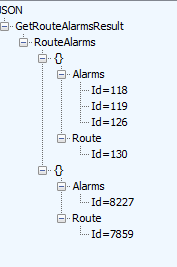
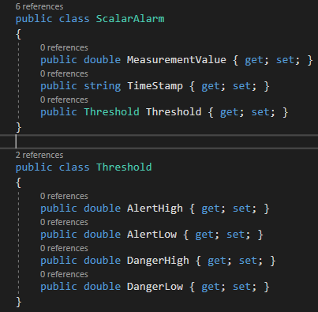

# This Section Describe the APIs implemeted in Entreprise Service Bus Integration application.

This application was implemented as a general solution to interact between SKF @A and Maximo platform. This REST application  has returns of JSON format and secured with "TransportCredentialOnly" with the following Credentials:
- username: skf
- password:moemo (please see Section Devops Guide for information about changing username and password)

# APIs

## R1 - Route Childrens/Points

| URL | Parameters |Return|  
|-----------|:-----------:|-----------
| aptitude/childrens | timeStamp | list of object PointIdentity  wrapped   with its route Id; Ids of points in both normal and alarm state |  

The `timeStamp` parameter is the time for the latest uploaded or synchronized data into @A. This parameter is found in ROUTEHDR table (LASTUPLOAD attribute).

A list of `PointsGroup` object which is composed from a list of object `PointIdentity` and its `RouteId` are returned.

  
_Figure 1 get route points_

## R2 - Route Assets/Machine

| URL | Parameters |Return|  
|-----------|:-----------:|-----------
| aptitude/assets| timeStamp | list of object AssetIdentity wrapped with its route Id; Ids of assets in both normal and alarm state |  

`timeStamp`: same as previous.

A list of `AssetsGroup` object which is composed from a list of object `AssetIdentity` and its `RouteId` are returned.

  
_Figure 2 get route assets_

## R3 - Route Assets In Alarm

| URL | Parameters |Return|  
|-----------|:-----------:|-----------
| aptitude/assets-in-alarms| timeStamp | list of object AlarmIdentity wrapped with its route Id; Ids of assets in alarm state |  

`timeStamp`: same as previous.
A list of `RouteAlarm` object which is composed from a list of object `Alarm` and its `RouteId` are returned.

  
_Figure 3 get route assets in alarm state_

## R4 - Route Childrens In Alarm
| URL | Parameters |Return|  
|-----------|:-----------:|-----------
| aptitude/points-in-alarms| timeStamp | list of object AlarmIdentity wrapped with its route Id; Ids of points in alarm state |  

`timeStamp`: same as previous.
A list of `RouteAlarm` object which is composed from a list of object `Alarm` and its `RouteId` are returned.

**Same object of R3**

_Figure 4 get route points in alarm state_

## R5 - Route Alarm By Asset

| URL | Parameters |Return|  
|-----------|:-----------:|-----------
| aptitude/alarms-by-asset| assetId| list of object AlarmIdentity; Ids of points in alarm state for one Asset |

`assetId` paramater can be collected from R2 or R3.

_Figure 5 get alarms in one asset_

## R6 - Asset Details
| URL | Parameters |Return|  
|-----------|:-----------:|-----------
| aptitude/asset| assetId| asset object |

`assetId` paramater can be collected from R2 or R3.

asset object: is composed from propreties shown in figure 6

    
_Figure 6 Asset Information_

Please Note: `ParentId` is one step up in the tree. Also, `HierarchyId` is the Id of the element in the main Hierarchy (the `AssetId` in the route is not the same as the one in the main hierarchy). The `HierarchyId` is used later on to get asset tracking information.

## R7 - Point Details
| URL | Parameters |Return|  
|-----------|:-----------:|-----------
| aptitude/point| pointId| point object |

`pointId` paramater can be collected from R1 or R4 & R5.

point object: is composed from propreties shown in figure 7

  
_Figure 7 Point Information_

## R8 - Message
## R9 - Note

## R10 - Segmenat and Asset tracking

| URL | Parameters |Return|  
|-----------|:-----------:|-----------
| aptitude/asset-details| elementId| SegmentAssetTracking object |

`elementId`: the assetId collected in R2 and R3 can not be used during this request to collect segment and asset tracking information. The `HierarchyId` collected in R6  shall be used as `assetId` instead.

SegmentAssetTracking: is composed from the propreties shown in figure 10

  
_Figure 10 Segment and Asset Tracking_

## R11 - Latest Measurement
| URL | Parameters |Return|  
|-----------|:-----------:|-----------
| aptitude/measurement| pointId| data measurement object |

`pointId` paramater can be collected from R1 or R4 & R5.
DataMeasurement object is composed from the propreties shown in figure 11.

   
_Figure 11 Data Measurement object_

`MeasurementId`: is the latest measurement, the returned `measurementId` is the one with the newest time interval.
`MeasurementType`: tells the type of the point; inspection, scalar or MCD..
`OperatorName`: 
`TimeStamp`: the new time of when new measurement is uploaded to @A

## R12 - Measurements
| URL | Parameters |Return|  
|-----------|:-----------:|-----------
| aptitude/measurements| pointId| list of data measurement object |

`pointId` paramater can be collected from R1 or R4 & R5.
DataMeasurement object is composed from the propreties shown in figure 11.

In this request all measurements for one specific point are collected without taking into consideration the timeStamp.

## R13 - Measurement Reading
| URL | Parameters |Return|  
|-----------|:-----------:|-----------
| aptitude/measReading| measId| MeasurementReading object |

`measId` paramater can be collected from previous request R11.
MeasrementReading object is composed from the propreties shown in figure 13.

   
_Figure 13 MeasurementReading object_

What is important in this request is the `ReadingId` which is used next to get the measurement.

## R14 - Measurements Readings
| URL | Parameters |Return|  
|-----------|:-----------:|-----------
| aptitude/measReadings| pointId| MeasurementReading object |

`pointId` paramater can be collected from previous request R1 or R4 & R5.
MeasrementReading object is composed from the propreties shown in figure 13.

in this request all readings for one point are returned.

## R15 - Measurement Alarm

| URL | Parameters |Return|  
|-----------|:-----------:|-----------
| aptitude/measAlarm| readingId| AlarmMeasurement object |

  
_Figure 15 AlarmMeasurement object

`readingId` parameter is collected from R13 or R14.
In this request The `AlarmId` and the `AlarmType` are important to decide the next request.

If the `AlarmType` is ScalarAlarm; Scalar Alarm request shall be made R17
If the `AlarmType` is InspectionAlarm; Inspection Alarm request shall be made R16
If the `AlarmType` is MCDAlarm; MCD Alarm request shall be made R18

## R16 - Inspection Alarm
| URL | Parameters |Return|  
|-----------|:-----------:|-----------
| aptitude/inspectionAlarm| measId & channel| inspectionAlarm object |

`measId`  parameter could be collected from R11
`channel` parameter could be collected from R13

InspectionAlarm object is represented in figure 16.

_Figure 16_ Inspection Alarm

## R17 - Scalar Alarm
| URL | Parameters |Return|  
|-----------|:-----------:|-----------
| aptitude/scalarAlarm| readingId & pointId | scalarAlarm object |

`readingId` parameter can be collected from R13 & R14
`pointId` parameter can be collected from R15, R1, R4 & R5

The ScalarAlarm object is composed from attributes shown in figure 17

   
_Figure 17_ ScalarAlarm Object

## R18 - MCD Alarm
| URL | Parameters |Return|  
|-----------|:-----------:|-----------
| aptitude/mcdAlarm | readingId & pointId | mcdAlarm object |

`readingId` parameter can be collected from R13 & R14
`pointId` parameter can be collected from R15, R1, R4 & R5

The MCDAlarm object is represented in figure 18.

_Figure 18_ MCDAlarm Object

## R19 - Measurement By Time Interval

## R20 - Hierarchy
| URL | Parameters |Return|  
|-----------|:-----------:|-----------
| aptitude/hierarchy| parentId| path of asset of type string |

`parentId` parameter could be collected from request R6

# App Architecture 
# Devops Guide
# Installation
# Repo